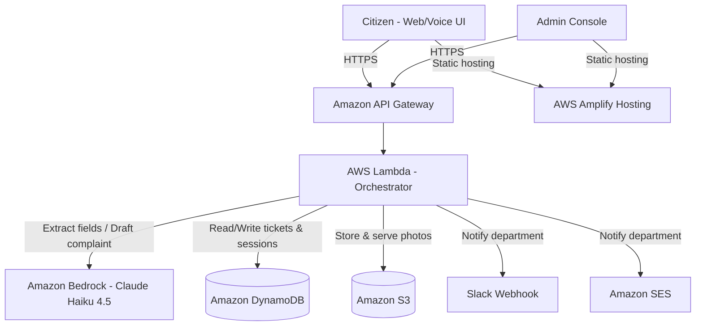

# 🏛️ Nagar Sahayak — AI Civic Complaint Assistant
A voice/text bot where someone reports a civic issue (broken streetlight, garbage pileup, water leakage) in Hindi/regional language, and an agent classifies it, drafts a formal complaint to the right municipal department, and tracks status.

**Report a civic issue in your own language. Get a ticket. Get it seen.**

Built for **WeMakeDevs — AWS First Commit Hackathon 2026** (Ship It track)

---

## 📖 Table of Contents

- [The Problem](#-the-problem)
- [The Solution](#-the-solution)
- [Key Features](#-key-features)
- [Architecture](#-architecture)
- [Tech Stack](#-tech-stack)
- [How It Works](#-how-it-works)
- [Screenshots](#-screenshots)
- [Getting Started](#-getting-started)
- [API Reference](#-api-reference)
- [Supported Languages](#-supported-languages)
- [Security Notes](#-security-notes)
- [What We Learned](#-what-we-learned)
- [Limitations & Future Work](#-limitations--future-work)
- [Team](#-team)
- [License](#-license)

---

## 🎯 The Problem

Every day, people encounter civic issues — a broken streetlight, an overflowing garbage bin, a pothole, a water leak — and most never report them. Not because they don't care, but because:

- They don't know **which department** is responsible
- Complaint portals are in **English only**, clunky, or require app downloads
- Writing a **formal complaint** that gets taken seriously takes effort
- There's **no way to track** what happens after filing

The result: small problems stay unreported and unfixed, indefinitely.

## 💡 The Solution

**Nagar Sahayak** ("civic helper") removes every one of these barriers. A citizen simply describes their problem — by typing or speaking, in any of 10 languages — and an AI agent:

1. Asks only for what's missing (location, severity) instead of a rigid form
2. Validates that the report is real and specific enough to act on
3. Drafts a formal, department-ready complaint automatically
4. Notifies the responsible department via **Slack and email**, with photos attached
5. Issues a trackable ticket ID the citizen can check anytime

A companion **admin console** lets civic staff triage, acknowledge, and resolve complaints — including a live map view of everything reported.

---

## ✨ Key Features

### Citizen-facing app
- 🗣️ **Multilingual by design** — full UI + voice input in English, Hindi, Mandarin, Spanish, French, Arabic, Bengali, Portuguese, Russian, and Urdu
- 🎙️ **Voice-to-text reporting** with a live waveform visualizer and automatic silence detection (stops recording after 4s of quiet)
- 🧠 **AI-driven multi-turn intake** — the agent asks only for genuinely missing details (issue type, specific location, severity), not a fixed form
- ✅ **Input validation that actually protects data quality**:
  - Rejects vague/junk input (e.g. "hi") without creating a ticket
  - Rejects vague locations ("my village") — requires a named place, a full address (20+ characters), or live GPS
  - Rejects invalid or out-of-range incident dates (no future dates, nothing older than 30 days, real calendar dates only)
- 📷 **Photo attachments**, uploaded directly to S3 via presigned URLs
- 📍 **Live GPS location sharing**
- 🎫 **Auto-generated ticket ID** with one-tap copy, and a live status tracker (Submitted → Acknowledged → Resolved)
- 📱 **Responsive design** — adapts from mobile (stacked controls) to tablet/desktop (wider, single-row layout) without ever overflowing the viewport
- 🐛 **In-app bug reporting** via a one-tap pre-filled email

### Admin console
- 📊 **Live dashboard** — total/submitted/acknowledged/resolved counts at a glance
- 🗺️ **Map view** (Leaflet + OpenStreetMap) plotting every complaint with a shared location, color-coded by status
- ✔️ **One-click status updates** — Acknowledge and Resolve actions that instantly reflect back to the citizen's status check
- 🖼️ Inline photo previews per complaint

---

## 🏗️ Architecture

**Flow summary:**
1. Citizen interacts with the chat UI (hosted on **Amplify**)
2. Requests hit **API Gateway**, routed to a single **Lambda** function
3. Lambda calls **Bedrock** (Claude Haiku 4.5) to extract structured fields turn-by-turn and draft the final complaint
4. In-progress conversations are held in a **DynamoDB** `sessions` table; finalized tickets live in a `complaints` table
5. Photos go straight to **S3** via presigned URLs (never through Lambda)
6. On completion, Lambda notifies the department via **Slack** and **SES** email, including photo links
7. The **admin console** (also on Amplify) reads/writes the same API to triage tickets and render the map view

---

## 🛠️ Tech Stack

| Layer | Technology |
|---|---|
| AI / NLU | Amazon Bedrock — Claude Haiku 4.5 |
| Compute | AWS Lambda (Python 3.12) |
| API | Amazon API Gateway (HTTP API) |
| Database | Amazon DynamoDB (`complaints`, `sessions` tables) |
| File Storage | Amazon S3 (presigned uploads, scoped public read for photos) |
| Email | Amazon SES |
| Team Alerts | Slack Incoming Webhooks |
| Hosting | AWS Amplify Hosting |
| Maps | Leaflet.js + OpenStreetMap tiles |
| Frontend | Vanilla HTML/CSS/JS (no framework, no build step) |
| Voice | Web Speech API (`SpeechRecognition`) + Web Audio API (waveform, silence detection) |

---

## 🔄 How It Works

1. **Citizen opens the app** → chooses a language (or defaults to English)
2. **Describes the issue** → by typing or speaking
3. **Agent asks follow-ups** only for what's missing:
   - Issue type (streetlight / garbage / pothole / water)
   - A specific location (named place, full address, or GPS)
   - Severity / condition
4. **Once complete**, Bedrock drafts a ~100-word formal complaint
5. **Ticket is created** in DynamoDB, department is notified via Slack + email (with any photos)
6. **Citizen receives a ticket ID** and is prompted to save it
7. **Admin staff** review, acknowledge, and resolve via the admin console — the citizen sees this reflected live when checking status

---

## 📸 Screenshots

### Citizen Chat 

### Admin Console 

### Map View

### Slack and Mail Notification

---

## 🚀 Getting Started

### Prerequisites
- An AWS account with access to: Bedrock, Lambda, API Gateway, DynamoDB, S3, SES, Amplify
- Bedrock model access granted for **Claude Haiku 4.5** in your region
- A Slack workspace (for webhook notifications) — optional but recommended

### 1. Deploy the backend (Lambda)
1. Create a Lambda function (Python 3.12 runtime)
2. Paste in [`lambda_function.py`](./lambda_function.py)
3. Attach IAM permissions: `AmazonBedrockFullAccess`, `AmazonDynamoDBFullAccess`, `AmazonS3FullAccess`, `AmazonSESFullAccess`
4. Set timeout to 30 seconds (Bedrock calls need more than the 3-second default)
5. See [Security Notes](#-security-notes) below before setting your secrets

### 2. Create DynamoDB tables
| Table | Partition Key |
|---|---|
| `complaints` | `ticket_id` (String) |
| `sessions` | `session_id` (String) |

### 3. Create an S3 bucket for photos
- Enable CORS for `PUT` from your app's origin
- Add a bucket policy allowing public `GetObject` scoped to the `complaints/` prefix only (needed so photo links render in Slack/email)

### 4. Set up API Gateway (HTTP API)
| Method | Path |
|---|---|
| `POST` | `/report` |
| `GET` | `/status` |
| `POST` | `/upload-url` |
| `GET` | `/admin/complaints` |
| `POST` | `/update-status` |

Enable CORS (`Access-Control-Allow-Origin: *`, methods `GET, POST, OPTIONS`) and deploy.

### 5. Verify SES identities
In sandbox mode, verify both a sender and a recipient email address under **SES → Verified identities**.

### 6. Deploy the frontend
- Update `API_BASE` in [`index.html`](./index.html) and [`admin.html`](./admin.html) to your API Gateway invoke URL
- Zip both files together (**at the zip root, no folder nesting**)
- Upload via **Amplify Hosting → Deploy without Git provider**

---

## 📡 API Reference

| Endpoint | Method | Purpose |
|---|---|---|
| `/report` | `POST` | Submit a message in an ongoing or new complaint session |
| `/status` | `GET` | Look up a ticket's current status by `ticket_id` |
| `/upload-url` | `POST` | Get a presigned S3 URL to upload a photo |
| `/admin/complaints` | `GET` | List all complaints (admin console) |
| `/update-status` | `POST` | Update a ticket's status (`Submitted`/`Acknowledged`/`Resolved`) |

---

## 🌐 Supported Languages

English · हिन्दी (Hindi) · 中文 (Mandarin) · Español · Français · العربية · বাংলা (Bengali) · Português · Русский · اردو (Urdu)

> UI chrome, error messages, and system prompts are localized. AI-generated content (drafted complaints, issue-type labels) currently renders in English regardless of UI language — see [Limitations](#-limitations--future-work).

---

## 🔒 Security Notes

This project was built under hackathon time constraints. Before deploying publicly or submitting this repo, note:

- **No authentication on the admin console** — anyone with the URL can change ticket statuses. Fine for a demo; not production-ready.
- **Secrets should not be hardcoded.** The Slack webhook URL, SES sender/recipient addresses, and S3 bucket name should be moved to **Lambda environment variables** rather than committed in source, especially before pushing this repo publicly.
- **S3 public read is scoped** to the `complaints/` prefix only — the rest of the bucket remains private.

---

## 🧠 What We Learned

Genuine first-time hurdles from this build (kept honest, not polished):

- **Bedrock model versioning**: the initially-used Claude 3.5 Sonnet model ID had reached end-of-life on Bedrock; had to switch to a current inference-profile ID.
- **Region-specific inference profiles**: Bedrock in `ap-south-1` (Mumbai) requires the `global.` inference profile prefix, not the `us.` prefix used by US regions — this isn't obvious from generic docs.
- **DynamoDB rejects native floats**: GPS coordinates (JS floats) must be converted to `Decimal` before writing, or the write silently fails.
- **CORS + Lambda errors compound**: an unhandled exception in Lambda returns a bare error with no CORS headers, which the browser reports as a confusing generic network failure rather than the real cause — wrapping the handler in try/except with CORS headers on every path fixed this permanently.
- **Deterministic > conversational for slot-filling**: relying on the LLM to track which fields were already collected and phrase a new question each turn was unreliable; moving state-tracking into plain Python (with the LLM used only for per-turn extraction and final drafting) fixed repeated/looping questions entirely.

---

## 🔭 Limitations & Future Work

- Admin console has no authentication (see [Security Notes](#-security-notes))
- Department routing is currently a static lookup for one city — a production version would need a real per-city/per-ward routing service
- AI-drafted complaint text and department names stay in English regardless of UI language
- No duplicate-complaint detection (two people reporting the same pothole currently creates two tickets)
- No automated escalation for tickets stuck in "Submitted" past a time threshold
- Translations for languages beyond English/Hindi are functional but not professionally reviewed

---

## 👥 Build By

**Ujjwal Pratap Singh** for WeMakeDevs — AWS First Commit Hackathon 2026.

---
